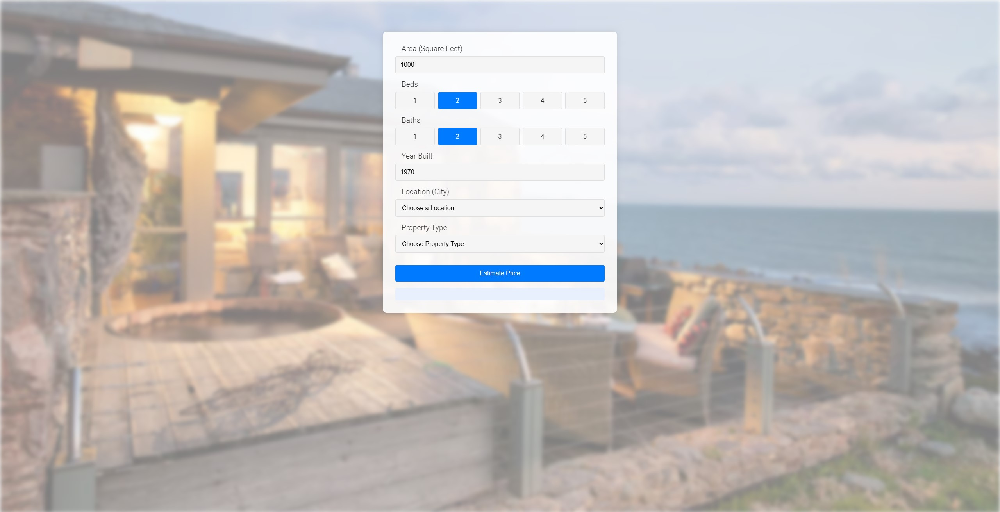
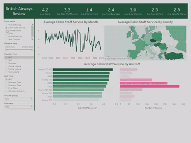

# Data Science Major

#### Technical Skills: Python, SQL, AWS, Tableau, ML

## Projects
### Southern California Home Price Predictor
[Project Files](https://github.com/Boxi-Lin/socal-home-price-predictor)

A full-stack machine learning web application that estimates home prices across Southern California based on real estate data from 2024 to early 2025. The backend is powered by a regression model built with scikit-learn and deployed via a Flask API. The frontend, designed with HTML, CSS, and JavaScript, enables users to input features such as location, square footage, bedrooms, and more. Hosted on Amazon EC2, this project demonstrates cloud deployment, API integration, and end-to-end model serving for real-world use.

### British Airways Customer Review Analysis

A data visualization project designed to uncover patterns in customer satisfaction with British Airways. The dashboard addresses the challenge of understanding how factors like aircraft type, travel class, and traveler demographics influence review scores. Using Tableau, the project transforms raw review data into interactive visuals that reveal insights by time, region, and flight characteristics. The result is a tool that supports strategic decisions around customer experience improvements and service performance monitoring.
